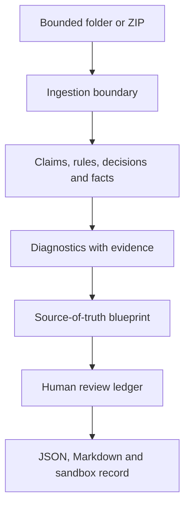

# Project MRI architecture

Project MRI is a bounded reference implementation of governed context diagnostics. Its job ends at an evidence-backed proposal and an explicit human review state.

## System shape

The pipeline is deterministic for the checked-in fixtures. A future model adapter may contribute candidate structured objects only behind the schema validator; it does not own authority, review or mutation.

## Responsibilities

| Component | Owns | Does not own |
|---|---|---|
| Ingestion | UTF-8 text loading, file limits, ZIP/path/symlink safety, hashes and line counts | execution of input code or mutation of input files |
| Extraction | typed object candidates and source line references | truth, authority or approval |
| Diagnostics | duplicate, near-duplicate, contradiction, stale/unclear authority, missing owner, orphan and scope-leak signals | final adjudication |
| Blueprint | candidate governing sources, history and unresolved human decisions | canonicalization without approval |
| Review ledger | approve/reject/unresolved state and audit history | writing to the original corpus |
| Evaluation | fixed fixture questions and observable proxy measures | general model accuracy or benchmark superiority |
| Web/CLI surfaces | readable inspection and export | privileged access, accounts or external publication |

## Evidence contract

Every finding carries:

- finding family and severity;
- deterministic, heuristic or model-assisted detection mode;
- uncertainty and proposed action;
- one or more source paths;
- one-based line ranges and source quotes where available.

The serialized result is validated against `project-mri.scan.v1`. Validation also checks that evidence paths exist in the loaded document inventory and that line ranges do not exceed the source line count.

## Authority and mutation boundary

Dates, metadata and explicit source labels can rank a candidate. They cannot make it authoritative. A reviewer may approve an intent, reject it or defer it. The current build records the decision but keeps `mutation_applied: false`.

The scanner never edits the input corpus. A future mutation-capable implementation would require a separate, explicit write boundary, a source-of-record policy, a diff, a reversible sandbox and a second readback. None of those capabilities is silently implied here.

## Safety boundary

Folder and ZIP ingestion rejects:

- unsupported corpus types;
- malformed ZIP files;
- absolute or parent-traversal ZIP members;
- ZIP symlinks and filesystem symlinks;
- over-limit member, corpus or file counts;
- invalid UTF-8;
- empty or unsupported corpora.

The server is local-only and does not accept arbitrary file uploads. The public fixture is synthetic.

## Extension seam

The stable seam for future integrations is:

`source adapter → normalized text records → MRI schema → diagnostics → review`

Provider operations such as document rendering remain optional and downstream. The current build does not require a provider, GPU or external model to run the demo, and it makes no live-provider claim.

## Deliberate non-goals

MRI is not a production connector, agent runtime, RAG engine, compliance product, autonomous repair system, multi-tenant service or truth oracle. It is a small instrument for finding where a project’s context asks an AI to believe too many incompatible things at once.

