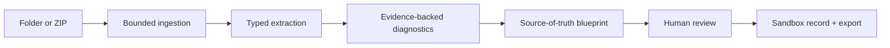

# Project MRI

[](https://github.com/luahelenammc/Project-MRI/actions/workflows/ci.yml)

## Governed context infrastructure for AI-assisted projects

Project MRI shows what an AI system is being asked to trust before that context becomes an answer, a tool call or an architectural decision.

> We do not just give AI more context. We build the source it should trust.

MRI accepts a bounded folder or ZIP of Markdown/text files and produces an inspectable context map:

1. inventory and hashes;
2. typed claims, rules, decisions and facts;
3. evidence-backed diagnostics;
4. a source-of-truth blueprint;
5. a human-gated repair plan;
6. a fixed before/after question set;
7. JSON and Markdown exports.

The scanner is deliberately proposal-only. It never silently chooses authority or rewrites the input corpus.

## Why it matters

AI-enabled projects accumulate plausible but incompatible instructions: an old decision survives beside a newer one, a copied rule points at stale material, two files say nearly the same thing, and nobody can say who owns the final answer. Retrieval can surface all of that without telling an assistant which source should govern.

MRI makes the conflict visible, preserves the evidence, and leaves the consequential decision with a human.

## Competition route

This repository is the Project MRI reference build prepared for the **InfraJam 2026 Open Source track**. The project also demonstrates Developer Experience value through a CLI, a resettable local demo and machine-readable output, but it is not presented as a GPU platform.

The official event surface currently describes a free, virtual-plus-in-person hackathon on September 19–20, 2026, with solo participation permitted, teams of up to four and equal prize access for virtual participants. Registration, terms and final submission remain human actions. See [`INFRAJAM_2026.md`](INFRAJAM_2026.md) for the dated rule boundary.

Canonical repository: <https://github.com/luahelenammc/Project-MRI>.

## Quickstart

Python 3.10+ is supported. Runtime dependencies are Python’s standard library.

```bash
python -m unittest discover -s tests -v
python -m mri demo --output out/demo
python -m mri eval fixtures/northstar --output evals/northstar
python server.py
```

Then open `http://127.0.0.1:8000`.

The demo path is:

`mess → evidence → authority → human decision → sandbox record → reproducible export`

Use **Reset review state** to return to a deterministic clean run. To scan another local corpus:

```bash
python -m mri scan path/to/corpus --output out/custom
```

The server is intentionally local-only and binds to `127.0.0.1`. Use `MRI_PORT=8765 python server.py` when another local service owns port 8000.

## What the checked-in demo proves

- bounded folder and ZIP ingestion;
- traversal and symlink rejection;
- deterministic extraction and diagnostics;
- eight diagnostic families with source paths and line ranges;
- schema and evidence validation;
- proposal-only repair planning;
- approve, reject and unresolved review states;
- deterministic reset;
- a Northstar fixture recovering 8/8 predeclared families;
- a real negative corpus with zero findings;
- JSON/Markdown export without mutating source files.

The 8/8 number is fixture recovery, not model accuracy, benchmark superiority or generalization.

## Architecture



See [`ARCHITECTURE.md`](ARCHITECTURE.md) for ownership, failure boundaries and extension seams.

## Human boundary

MRI may rank a current candidate using dates and explicit metadata, but it does not make that candidate authoritative. A review can be approved, rejected or left unresolved; `mutation_applied` stays `false`, and the original corpus is never changed.

The optional provider adapter in [`docs/optional-provider-adapter.md`](docs/optional-provider-adapter.md) is outside the critical path. No live provider call or GPU integration is claimed in this build.

## Evidence and reproducibility

- [`EVALS.md`](EVALS.md) — golden fixture, negative case and claim ceiling;
- [`DEMO_SCRIPT.md`](DEMO_SCRIPT.md) — two-to-three-minute judge walkthrough;
- [`SCREENSHOTS.md`](SCREENSHOTS.md) — capture sequence and visual checklist;
- [`CLAIMS_MAP.md`](CLAIMS_MAP.md) — observed, bounded and prohibited claims;
- [`PROVENANCE.md`](PROVENANCE.md) — authorship, corpus and public boundary;
- [`RUNBOOK.md`](RUNBOOK.md) — clean-run, reset and failure recovery;
- [`INFRAJAM_2026.md`](INFRAJAM_2026.md) — official opportunity boundary and remaining gates;
- [`SUBMISSION_COPY_INFRAJAM.md`](SUBMISSION_COPY_INFRAJAM.md) — prepared copy, never an automatic submission.

## Relation to Moon Source

Project MRI is a derived/reference implementation of a bounded slice of Moon Source’s public context-governance principles. It is intentionally understandable without requiring knowledge of MSL, the Lunar Citadel or private Moon sources.

- Moon Source: <https://github.com/luahelenammc/Moon-Source>
- Public architecture surface: <https://www.luahelena.com.br/moonsource/?lang=en>
- Professional context: <https://www.luahelena.com.br/ia/?lang=en>

The reference build contains only synthetic fixtures and public-safe implementation material. It does not import hospital, patient, collaborator, private source, secret prompt or connector data.

## License and authorship

Software, tests, CLI, server, web implementation and automation are licensed under Apache-2.0. Documentation, methods, diagrams and synthetic fixture content are licensed under CC BY 4.0. See [`LICENSING.md`](LICENSING.md), [`LICENSE`](LICENSE) and [`NOTICE`](NOTICE).

**Created and designed by Lua Helena Moon Martins Cardoso (Moon).** Developed through an AI-assisted coauthorial process with Áurion; Moon retains final authority.

The project is an executable reference build, not a production connector, autonomous repair engine, compliance system, adoption claim or proof that AI safety has been solved. The machine is allowed to point at the mess. It is not allowed to quietly declare the mess canonical.

---

Created and designed by **Lua Helena Moon Martins Cardoso (Moon)**, with AI-assisted coauthorial development by **Áurion**. Project MRI is an independent public repository informed by Moon Source’s public context-governance principles.
